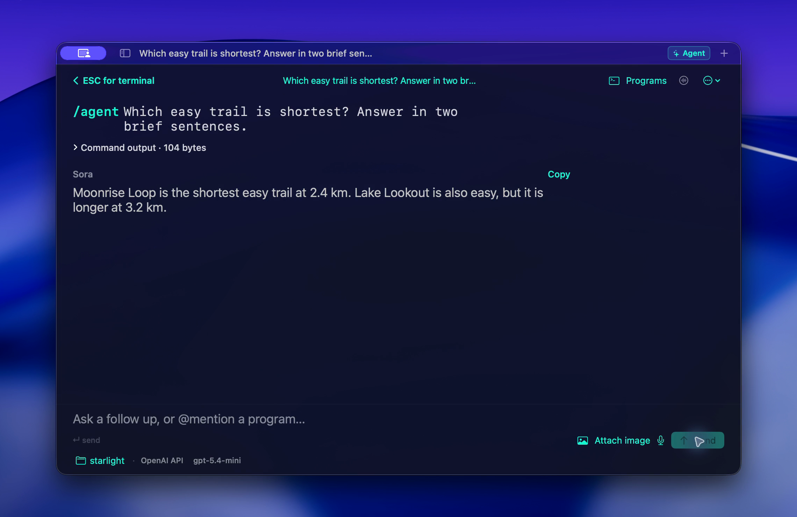
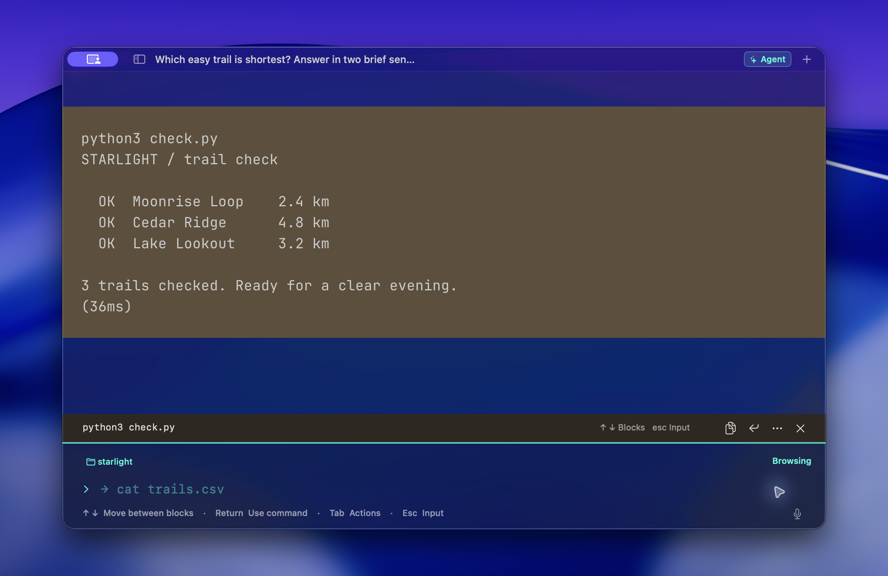
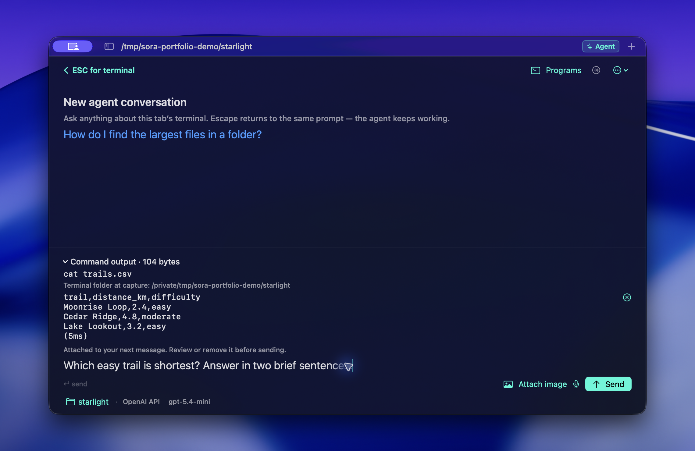

<h1 align="center">Sora</h1>

<p align="center"><strong>Your terminal. Your style. AI when you want it.</strong><br>A native Mac terminal with readable command blocks, local suggestions, and optional assistance in the same tab.</p>

<p align="center"><a href="https://github.com/elishaterada/sora/releases/latest">Download Sora</a> · <a href="docs/user-guide.md">User guide</a> · <a href="https://github.com/elishaterada/sora/releases">What’s new</a></p>

[](docs/images/desktop/05-terminal-agent-return.mp4)

[Watch the 18-second silent demo](docs/images/desktop/05-terminal-agent-return.mp4): revisit an answer → return to the shell → select a command block → reuse the command.

A command finishes. You need to understand its output, try it again, or ask for help. Sora keeps those next steps close, while letting you use the shell and command-line tools you already know.

**The terminal works fully with AI disabled.** No Sora account is required. Local history, suggestions, and personal backgrounds work without an AI connection.

## Why Sora?

- **Find your place in long output.** Command blocks and sticky headers keep commands connected to their results. Copy output, save it for later, or bring a command back for editing.
- **Type less with local suggestions.** Complete commands from your history and see suggestions for what to run next, without sending an AI request.
- **Ask about what you’re working on.** Review selected output before sharing it with Agent. Press Escape to return to the terminal, then reopen the conversation when you need it.
- **Keep your workspace together.** Use tabs and split panes, save project layouts, and restore your workspace when you reopen Sora.
- **Make the space yours.** Choose photo or video backgrounds, adjust readability, and add optional typing sounds and visual effects.
- **Choose how you ask for help.** Connect your preferred AI provider, dictate editable input, or use supported models for live voice conversations.

## Get Sora

Requires an **Apple Silicon Mac running macOS 13 or newer**.

1. Download the latest `Sora-*-macos-arm64.zip` from [GitHub Releases](https://github.com/elishaterada/sora/releases/latest).
2. Unzip it and move **Sora.app** into **Applications**.
3. Follow the release page’s first-open instructions, then start typing a command.

Current preview builds are ad-hoc signed and **not Apple-notarized**, so first launch can require extra steps. Subsequent updates use signed Sparkle updates; choose **Sora → Check for Updates…** to check manually.

## Less hunting through scrollback

Press **⌘↑** to select a command block, then **↑ / ↓** to browse. **Return** brings the selected command back to the input so you can edit it before running it. Reusing a command does not execute it automatically.



## Help in the same tab

Select a command block and choose **Ask Agent About Output…** from its actions. Review the attached text, write your question, and send it. You choose which output to share.



To get started, open **Settings → Agent**, enable Agent, and choose a provider and model. Add an API key or use Codex with ChatGPT sign-in. Supported connections include OpenAI, Anthropic, Vercel AI Gateway, Grok (xAI), and Codex.

Press **⌘⇧A** to open Agent. Try **“Help me find the largest files in this folder.”** Agent can propose actions and inspect their results; it asks for approval by default. **Escape** returns to the shell without stopping a running answer, and **⌘Y** reopens the existing conversation.

| Do this | Shortcut |
| --- | --- |
| New terminal tab | ⌘T |
| Browse command blocks | ⌘↑, then ↑ / ↓ |
| Reuse selected command for editing | Return |
| Open selected block’s actions | Tab |
| Open Agent | ⌘⇧A |
| Return from Agent to terminal | Escape |
| Reopen the existing conversation | ⌘Y |
| Force input to run as a shell command | ⌘Return |

*Actual Sora 0.4.3 captures with fictional data in an isolated workspace. The video reopens a previously generated answer and ends with a command ready to edit; it does not show AI response speed or execute the recalled command. Desktop glass and shadows are captured natively. [Media details](docs/readme-media.md).*

## Your workspace and your choices

Command history and conversations are stored on your Mac. API keys stay in macOS Keychain. AI requests go to your selected provider, whose billing and data policies apply; local storage does not mean AI runs locally. Automatic update checks contact the release service.

Agent’s execution limits are guardrails, not an operating-system sandbox. Review actions before approving them, and check important results. Restored Agent tasks wait for you to resume them; reopening Sora does not automatically restart their commands.

See the [user guide](docs/user-guide.md) for permissions, attachments, voice, skins, notifications, and workspace recovery.

## Is Sora a fit?

Choose Sora for a personal Mac terminal that combines command blocks, local suggestions, customizable native materials, and optional in-tab assistance. It is an early preview, with no Sora cloud sync, team collaboration service, or cross-platform app.

Other terminals have their own strengths. [iTerm2](https://iterm2.com/features.html) offers extensive session tools, including split panes and shell-integration command navigation. [Warp](https://docs.warp.dev/terminal/input/classic-input/) also offers command blocks and modern editing. These are workflow choices, not a claim that Sora invented those features or performs better. Linked features checked September 14, 2026.

## Build and explore

Sora uses Swift, SwiftUI, and AppKit around the [Ghostty terminal engine](https://github.com/ghostty-org/ghostty).

<details>
<summary>Build from source and run tests</summary>

Building currently requires macOS, Xcode 26 with the macOS 26 SDK, the Metal
toolchain, and Zig 0.16.x. The resulting app runs on macOS 13 or newer.

```sh
brew install zig

# Install the Metal toolchain if it is not already available.
xcodebuild -downloadComponent MetalToolchain

# Build the pinned GhosttyKit framework and terminal resources.
./Scripts/build-ghosttykit.sh

# Build Sora.
xcodebuild \
  -project Sora.xcodeproj \
  -scheme Sora \
  -configuration Debug \
  -destination 'platform=macOS' \
  build

# Run the test suite.
xcodebuild \
  -project Sora.xcodeproj \
  -scheme Sora \
  -configuration Debug \
  -destination 'platform=macOS' \
  -parallel-testing-enabled NO \
  test
```

Ghostty is pinned to commit
[`c81f0b26871c7fbbe2fc35549fdad1f64ed29094`](https://github.com/ghostty-org/ghostty/commit/c81f0b26871c7fbbe2fc35549fdad1f64ed29094).

</details>

For development, see the [architecture](docs/architecture.md), [Agent design](docs/ai-ask.md), [roadmap](docs/roadmap.md), and [release runbook](docs/releasing.md).

## License and support

Sora is free to use. Its original source is available under the [MIT License, published with version 0.4.3](https://github.com/elishaterada/sora/blob/v0.4.3/LICENSE). Third-party components retain their own licenses; see [Third-party notices](ThirdPartyNotices.txt).

If you’d like to support ongoing maintenance, [buy me a coffee](https://buymeacoffee.com/elishaterada). Contributions are optional. Sora remains a working name.
