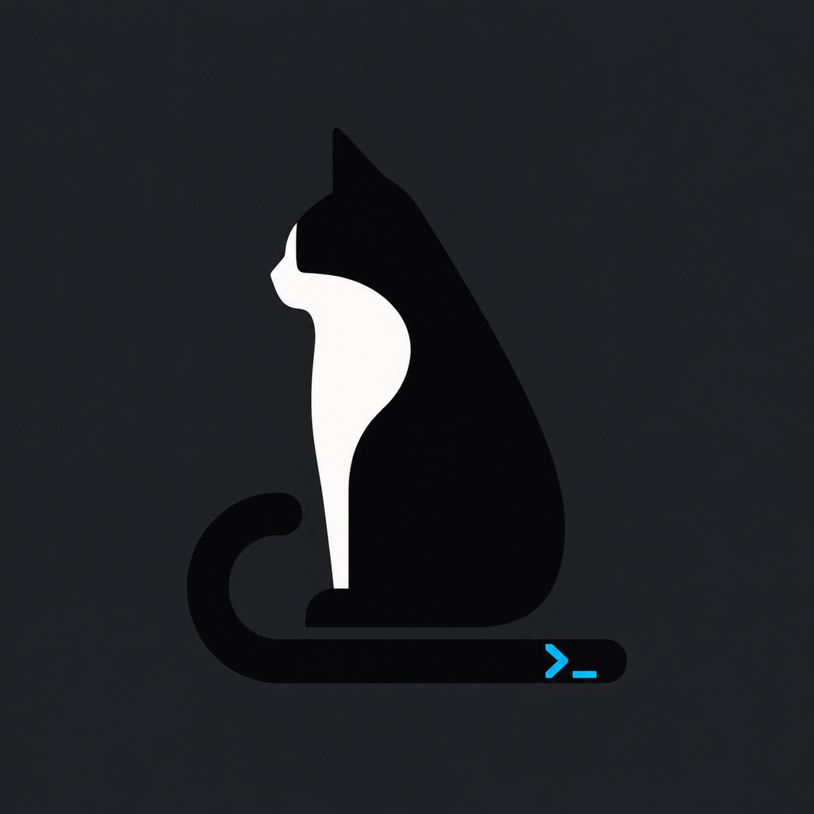

<p align="center">
  
</p>

<h1 align="center">Sora</h1>

<p align="center">
  A fast, native macOS terminal with local command intelligence and an optional AI agent.
</p>

> [!IMPORTANT]
> Sora is an early preview and a working name. It has not completed public
> naming or trademark review.

Sora starts with a real terminal and adds assistance without making the terminal
depend on AI. It is built in Swift for macOS and uses
[libghostty](https://github.com/ghostty-org/ghostty) for terminal emulation and
rendering.

## Highlights

- **A native terminal:** Ghostty-backed rendering, a real login `zsh`, tabs,
  copy and paste, responsive resizing, scrollback, clickable links, and macOS
  window materials.
- **Readable command history:** command output is grouped with durable visual
  boundaries that reflow, scroll, and clear with the terminal grid.
- **Local command intelligence:** inline completion from local history plus
  lightweight next-command suggestions. No AI call is made for either feature.
- **Voice input:** dictate editable terminal or Agent input, or have a live
  spoken Agent conversation with a supported OpenAI Realtime model.
- **Agent in the same tab:** ask a question at the prompt and move into a native
  Agent view without losing the terminal beneath it. Escape returns to the
  prompt while an answer continues.
- **Progressive answers:** Agent replies render Markdown, links, code, and
  filesystem paths as they stream.
- **Your choice of provider:** OpenAI API, Codex with ChatGPT sign-in, Anthropic
  API, Vercel AI Gateway, and Grok (xAI).
- **Bounded command execution:** review proposed commands before running them,
  allow a narrow set of read-only commands automatically, or explicitly enable
  full access.
- **Signed in-place updates:** release builds check GitHub once at launch and
  can download, replace, and relaunch the app through Sparkle.

## Download

Download the newest build from [GitHub Releases](https://github.com/elishaterada/sora/releases/latest).
Each release includes a plain-language summary of what changed. The complete
release history is available in the [changelog](CHANGELOG.md).

Current release artifacts are for **Apple Silicon Macs** running **macOS 13 or
newer**. Builds are ad-hoc signed but not Apple-notarized, so macOS will show a
Gatekeeper warning on first launch.

1. Download and unzip the latest `Sora-*-macos-arm64.zip`.
2. Move `Sora.app` to `/Applications` or `~/Applications`.
3. Right-click Sora and choose **Open**, then confirm **Open**.

If Gatekeeper still blocks the app, clear the downloaded quarantine attribute:

```sh
xattr -cr /Applications/Sora.app
```

Version 0.1.3 and newer can install subsequent signed updates from inside the
app. The first Sparkle-capable version must be installed manually.

## Command history and block navigation

With the input focused, press **Up or Down** to open that tab’s command history above the
prompt. The newest command is selected first; Up moves older and Down moves
newer. A typed prefix narrows the list. **Return** runs the selected command;
**Tab**, clicking a row, or typing keeps it in the input for editing. **Escape**
or Down beyond the newest entry restores your original draft and cursor.
History shows up to 200 distinct recent commands recorded by Sora across tabs
and app launches. It works with Agent disabled. **Control-P/Control-N** retain
ordinary shell history, and arrows within a multiline draft retain cursor editing.

Press **Cmd+Up** or click a completed block to browse output. **Up/Down** then
move between blocks; Down after the newest block or **Escape** returns to input.
Typing or pasting while browsing blocks returns to the unchanged draft.

Click a completed block to select it, or right-click for its actions. The action
bar offers **Copy Output**, **Use Command in Input**, and a menu for copying the
command, copying the whole block, or saving output. **Tab** opens that menu from
a selected block; **Cmd+C** copies the whole block. **Return** places the selected
command in the input for editing without executing it. Explicitly using a command
replaces the draft and saves the old draft in zsh's kill buffer.

Block actions use the text displayed in the terminal, including the timing footer
in output. They work with Agent disabled. Running programs keep their arrow keys.
Command boundaries are saved with terminal output, so clicking and navigating
blocks also works after relaunch. Archives saved by older versions may lack
those boundaries and support text selection only.

Trackpad scrolling moves smoothly between text rows, following macOS momentum.
Block highlights and text selection stay aligned while scrolling. A sticky header
keeps the command visible while you read its output, yielding to the next block.

Images can be dropped onto the terminal output or input area. At a shell prompt,
Sora inserts quoted file paths. While a program is running, it puts the image
pixels on the macOS clipboard and sends Control-V for programs such as Codex CLI.
Command-V also forwards copied images this way. Drop one image at a time into
running programs; the last image remains on the clipboard.
Files keep their original locations; image-data and promised-file drops are
saved under Sora's Application Support folder. Dropping never submits a command.

Agent also accepts dropped images or **Attach image**. Thumbnails stay in the draft until Send. Image bytes are saved with the conversation and sent to the selected service; a vision-capable model is required. Up to four images can be attached per message (5 MB as PNG and 8192 pixels per side).

## Terminal notifications

Background terminal sessions can send native macOS alerts using OSC 9, OSC 777,
or a terminal bell (BEL), including CLI agents that emit these signals. Sora
asks for notification permission on the first background alert. Allow it to see
banners and hear sounds. **Sora Settings → Terminal → Notifications** lets you
turn alerts off, check permission, and open macOS notification settings. Tab
attention badges remain available with alerts off. You can change permission in **System Settings → Notifications
→ Sora**. Clicking an alert returns to its originating tab while that tab is open.
The focused terminal stays quiet, and repeated alerts are limited to one per tab
per five seconds. This works with Sora's optional Agent disabled.

To check delivery, run this in Sora and switch to another tab before it finishes:

```sh
sleep 3; printf '\033]9;Agent finished its work\007'
```

A CLI must have its own notifications enabled and emit a supported signal;
Sora does not infer completion by reading its output. Terminal bells carry no
completion text, so their alerts say “Terminal needs attention.”

## Using Agent

Agent is optional and disabled until you configure it.

1. Open **Agent** from the window chrome, or press **Cmd+Shift+A**.
2. Choose a provider and model.
3. Add that provider's API key, or use Codex with ChatGPT sign-in.
4. Enable Agent.

At a ready prompt, type a conversational request such as:

```text
Help me find the largest files in this folder
```

Sora labels conversational input before submission. Press **Return** to send it
to Agent, **Cmd+Return** to force it to the shell, or begin with `/agent ` to
force a command-like question to Agent.

### Command permissions

| Mode | Behavior |
| --- | --- |
| Ask for approval | Every proposed command and webpage fetch waits for you. This is the default. |
| Approve for me | A small, validated set of read-only listing commands may run automatically. Everything else still waits. |
| Full access | Validated proposals run without confirmation using your user account's filesystem permissions. |

Agent actions are limited to six per turn, each command has a 60-second timeout,
and captured output is bounded. This approval layer is intentionally
conservative, but it is not an operating-system sandbox.

Provider access is not included with Sora. API providers may require their own
account, key, or paid usage. Codex authentication uses the user's existing
ChatGPT/Codex access.

## Privacy and data

- The terminal, history completion, and next-command suggestions work without
  Agent and make no AI requests.
- Voice dictation uses macOS Speech Recognition only while the microphone
  control is active. It never submits the resulting text automatically.
- Realtime voice sends microphone audio and conversation transcripts to the
  OpenAI API while its visible waveform control is active. Leaving Agent ends
  the session and releases the microphone.
- Sora does not automatically send terminal output, repository contents,
  environment variables, working directories, or command history to a provider.
- Agent sends only the question, completed conversation turns, and results from
  actions you approved or allowed through the selected permission mode.
- API keys are stored in the macOS Keychain and are not written to settings,
  SQLite, conversation files, or source control.
- Conversations are stored locally per provider in
  `~/Library/Application Support/Sora/` as plaintext files with user-only
  permissions.
- There is no Sora account, cloud sync, analytics service, or hosted backend.

Each AI provider has its own data-retention and billing terms. Review those
terms before enabling Agent.

## Build from source

Building currently requires macOS, Xcode 26 with the macOS 26 SDK, the Metal
toolchain, and Zig 0.16.x. The resulting app runs on macOS 13 or newer.

```sh
brew install zig

# Install the Metal toolchain if it is not already available.
xcodebuild -downloadComponent MetalToolchain

# Build the pinned GhosttyKit framework and terminal resources.
./Scripts/build-ghosttykit.sh

# Build Sora.
xcodebuild \
  -project Sora.xcodeproj \
  -scheme Sora \
  -configuration Debug \
  -destination 'platform=macOS' \
  build

# Run the test suite.
xcodebuild \
  -project Sora.xcodeproj \
  -scheme Sora \
  -configuration Debug \
  -destination 'platform=macOS' \
  -parallel-testing-enabled NO \
  test
```

Ghostty is pinned to commit
[`c81f0b26871c7fbbe2fc35549fdad1f64ed29094`](https://github.com/ghostty-org/ghostty/commit/c81f0b26871c7fbbe2fc35549fdad1f64ed29094).

## Project status

Sora is under active development. The native terminal, tabs, command history,
local completion, next-command prediction, optional Agent providers, bounded
agent actions, and signed update flow are implemented. Accounts, cloud sync,
collaboration, a hosted backend, and cross-platform support are intentionally
out of scope for this preview.

For implementation details, see:

- [Architecture](docs/architecture.md)
- [Agent behavior, permissions, and provider boundaries](docs/ai-ask.md)
- [Roadmap](docs/roadmap.md)
- [Ghostty integration](docs/libghostty-integration.md)
- [Licensing and third-party notices](docs/licensing.md)
- [Working-name notes](docs/naming.md)

## Licensing

No license for Sora's original source code has been published yet. Third-party
components retain their own licenses; see [ThirdPartyNotices.txt](ThirdPartyNotices.txt)
and [docs/licensing.md](docs/licensing.md).
